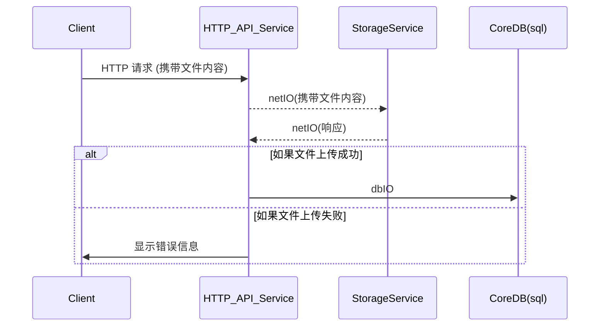
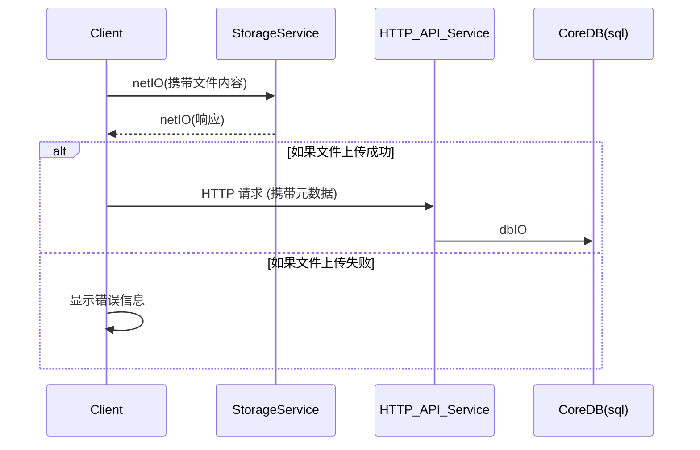

# file storage

## 本地文件系统

- **优点**：简单易用，适合小型应用和开发环境。
- **缺点**：不适合大规模应用，难以扩展和管理，存在单点故障风险。

## 对象存储(OSS, S3)

- **优点**：高可用性、高扩展性、支持大规模存储、内置安全和备份机制。
- **缺点**：需要额外的配置和管理，可能会有延迟。

Amazon S3,  MinIO 、阿里云 OSS、Google Cloud Storage

S3: Simple Storage Service or Object Storage Service (OSS)

## 分布式文件系统

- **优点**：高可用性、高扩展性，适合大数据处理。
- **缺点**：复杂性高，管理和维护成本较高。

HDFS、Ceph

## CDN (内容分发网络)

- **优点**：加速内容分发，提高访问速度，减轻服务器负载。
- **缺点**：主要用于静态内容分发，不适合动态文件存储。

## demo

### 1. form 上传文件 (服务端代理上传)



### 2. auth + (http/form or other) + json 上传文件



0.POST api_url 拿到 upload_url(预签名URL)

```json filename="response.json"
[{"url":"https://sea1.ingest.uploadthing.com/8K7d46uF3ucg7T0OvXwRiQh1fPIWoGzSrdmlguCLY0jqpxE3?expires=1740116556187&x-ut-identifier=e45m00pl34&x-ut-file-name=postcss.config.mjs&x-ut-file-size=135&x-ut-file-type=application%252Fx-javascript&x-ut-slug=videoAndImage&x-ut-custom-id=0-a521f40f-f649-43d4-8720-ca7b05c05409&x-ut-content-disposition=inline&signature=hmac-sha256%3D4d8f028ea6eae35410d5e7112a2dba737ea4c063f14ac317e2770163c63b4ee9","key":"8K7d46uF3ucg7T0OvXwRiQh1fPIWoGzSrdmlguCLY0jqpxE3","name":"postcss.config.mjs","customId":"0-a521f40f-f649-43d4-8720-ca7b05c05409"},{"url":"https://sea1.ingest.uploadthing.com/8K7d46uF3ucg56jugJN9o2HyghBwTOGlsVvCjp1aN0rcuLZM?expires=1740116556189&x-ut-identifier=e45m00pl34&x-ut-file-name=README.md&x-ut-file-size=1450&x-ut-file-type=blob&x-ut-slug=videoAndImage&x-ut-custom-id=1-ae310e89-6972-4490-a9b6-f32c7d6c6420&x-ut-content-disposition=inline&signature=hmac-sha256%3D16d531ea14a73e800b3edf46cc192183a9896a50bdda7be2d8079cae44a2abe5","key":"8K7d46uF3ucg56jugJN9o2HyghBwTOGlsVvCjp1aN0rcuLZM","name":"README.md","customId":"1-ae310e89-6972-4490-a9b6-f32c7d6c6420"}]
```

```ts
for (let i of items) {
  // [{"url":"https://sea1.ingest.uploadthing.com/8K7d46uF3ucg/yuuka-256.webp?expires=1740124580399&x-ut-identifier=e45m00pl34&x-ut-file-name=yuuka-256.webp&x-ut-file-size=11238&x-ut-slug=videoAndImage&x-ut-file-type=image%2Fwebp&x-ut-content-disposition=inline&x-ut-acl=public-read&signature=hmac-sha256%3D791fde5908e89cda6f1935c11c5aa1a6a3a4d36194496a66310c31ed0e436773","key":"8K7d46uF3ucg/yuuka-256.webp","name":"yuuka-256.webp"}]
  // scheme
// 	https
// host
// 	sea1.ingest.uploadthing.com
// filename
// 	/8K7d46uF3ucg/yuuka-256.webp
// expires
// 	1740124580399
// x-ut-identifier
// 	e45m00pl34
// x-ut-file-name
// 	yuuka-256.webp
// x-ut-file-size
// 	11238
// x-ut-slug
// 	videoAndImage
// x-ut-file-type
// 	image/webp
// x-ut-content-disposition
// 	inline
// x-ut-acl
// 	public-read
// signature
// 	hmac-sha256=791fde5908e89cda6f1935c11c5aa1a6a3a4d36194496a66310c31ed0e436773
  // [{"url":"https://sea1.ingest.uploadthing.com/8K7d46uF3ucgWu3bhbgsmQlRAwfS4vt0WiHaok52bdUG8yOD?expires=1740124923316&x-ut-identifier=e45m00pl34&x-ut-file-name=star-72.svg&x-ut-file-size=309&x-ut-file-type=image%252Fsvg%252Bxml&x-ut-slug=videoAndImage&x-ut-content-disposition=inline&x-ut-acl=public-read&signature=hmac-sha256%3D861af3c0d5ef9c1b6722f886cd4f12c995272c957ddb784ec9580d958969eece","key":"8K7d46uF3ucgWu3bhbgsmQlRAwfS4vt0WiHaok52bdUG8yOD","name":"star-72.svg","customId":null}]
  // 1.HEAD upload_url 用于实现可续上传
//   scheme
// 	https
// host
// 	sea1.ingest.uploadthing.com
// filename
// 	/8K7d46uF3ucgWu3bhbgsmQlRAwfS4vt0WiHaok52bdUG8yOD
// expires
// 	1740124923316
// x-ut-identifier
// 	e45m00pl34
// x-ut-file-name
// 	star-72.svg
// x-ut-file-size
// 	309
// x-ut-file-type
// 	image%2Fsvg%2Bxml
// x-ut-slug
// 	videoAndImage
// x-ut-content-disposition
// 	inline
// x-ut-acl
// 	public-read
// signature
// 	hmac-sha256=861af3c0d5ef9c1b6722f886cd4f12c995272c957ddb784ec9580d958969eece
  // 2.PUT upload_url 上传文件 (携带文件内容)
  const formData = new FormData();
  formData.append("file", file);

  await fetch(presigned.url, {
    method: "PUT",
    body: formData,
  });
  // 3.OPTIONS upload_url 上传完成后的回调
}
```

## 应用

### Alist

**Alist** 是一个开源的文件列表程序，支持多种存储后端，包括本地文件系统、对象存储等。它可以帮助用户轻松管理和展示文件列表，适合个人和小型团队使用。

### 示例代码

以下是一个示例，展示如何在创建 `ProjectRelease` 时生成文件路径，并将其存储在对象存储中（如 Amazon S3）。

#### createDBProjectRelease.ts

```typescript
import { db } from "~/lib/db";
import { projectRelease_table, releaseFile_table } from "~/lib/db/schema/proj";
import { v4 as uuidv4 } from 'uuid';
import { S3 } from 'aws-sdk';

type CreateDBProjectReleaseInput = {
  name: string;
  project_id: string;
  creator_id: string;
  version_number: string;
  game_versions: string[];
  type: string; // release, beta, alpha
  description?: string;
  project: {
    loaders: string[];
  },
  files: {
    filename: string
    url: string
    size: number
    is_primary: boolean
    type: string
  }[]
}

const s3 = new S3({
  accessKeyId: process.env.AWS_ACCESS_KEY_ID,
  secretAccessKey: process.env.AWS_SECRET_ACCESS_KEY,
  region: process.env.AWS_REGION,
});

export const createDBProjectRelease = async (input: CreateDBProjectReleaseInput) => {
  // 1. 创建 ProjectRelease
  const [created_release] = await db.insert(projectRelease_table).values({
    id: uuidv4(),
    created_at: new Date(),
    name: input.name,
    proj_id: input.project_id,
    version_number: input.version_number,
    game_versions: input.game_versions,
    creator_id: input.creator_id,
    featured: false,
    description: input.description || '',
    type: input.type,
    status: 'listed',
    visibility: 'public',
  }).returning();

  // 2. 上传文件到 S3 并创建 ReleaseFile 列表
  const created_files = await Promise.all(input.files.map(async file => {
    const fileKey = `project/${input.project_id}/release/${created_release.id}/${file.filename}`;
    const uploadParams = {
      Bucket: process.env.AWS_S3_BUCKET_NAME,
      Key: fileKey,
      Body: file.url, // Assuming file.url is the file content
      ContentType: file.type,
    };
    await s3.upload(uploadParams).promise();

    return db.insert(releaseFile_table).values({
      id: uuidv4(),
      release_id: created_release.id,
      url: `https://${process.env.AWS_S3_BUCKET_NAME}.s3.${process.env.AWS_REGION}.amazonaws.com/${fileKey}`,
      download_count: 0,
      filename: file.filename,
      is_primary: file.is_primary,
      size: file.size,
      type: file.type,
      metadata: {},
    }).returning();
  }));

  // 3. 更新 Project（如果需要）
  // 这里可以添加更新项目的逻辑，例如更新项目的最新版本信息等

  return { created_release, created_files };
}
```

### 解释

1. **创建 `ProjectRelease`**：
   - 使用 `uuidv4` 生成唯一的发布版本 ID。
   - 将发布版本的数据插入到 `projectRelease_table` 表中。

2. **上传文件到 S3 并创建 `ReleaseFile` 列表**：
   - 为每个文件生成唯一的 S3 路径，格式为 `project/${project_id}/release/${release_id}/${filename}`。
   - 使用 AWS SDK 将文件上传到 S3。
   - 将文件的数据插入到 `releaseFile_table` 表中。

3. **更新项目**：
   - 如果需要，可以在这里添加更新项目的逻辑，例如更新项目的最新版本信息等。

通过这种方式，可以确保文件的路径唯一且结构清晰，同时利用对象存储的高可用性和高扩展性来管理文件。
